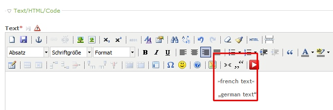

Contao Extension: TinyMceQuotes
================================

Special TinyMCE plugin to add french and german quotes into the editor via button.

The sources of this plugin could be found [here](http://www.dream-a-bit.de/plugin-fuer-deutsche-und-franz-anfuehrungszeichen.html).

Installation
------------

The extension is not published in contao extension repository.
Install it manually or via [composer](https://packagist.org/packages/cliffparnitzky/tiny-mce-quotes).

Tracker
-------

https://github.com/cliffparnitzky/TinyMceQuotes/issues

Compatibility
-------------

- min. version: Contao 3.0.x
- max. version: Contao 3.2.x

Dependency
----------

- To load this plugin and add it to the configuration the extension [[TinyMcePluginLoader]](https://github.com/cliffparnitzky/TinyMcePluginLoader) has to be installed.

Screenshot
----------

